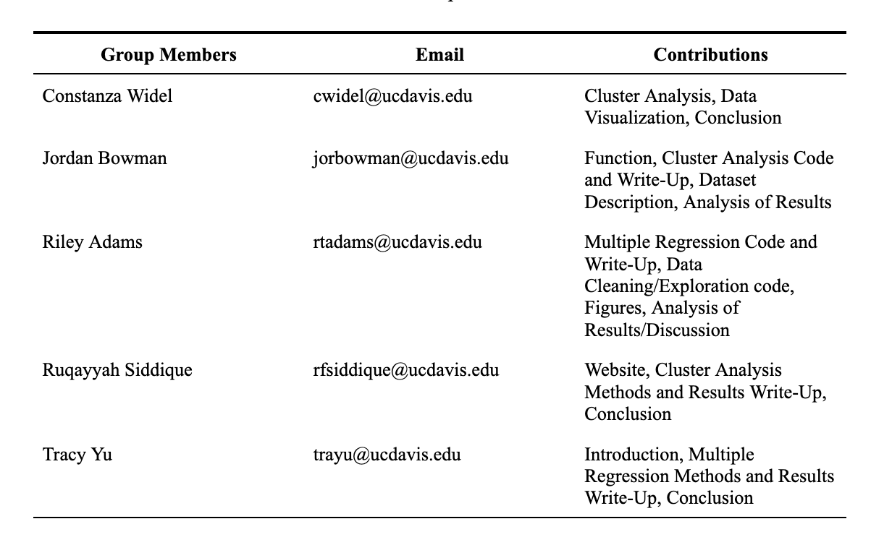

```{css, echo =FALSE}
h1.title {
  font-size: 38px;
  color: mediumslateblue;
  text-align: center;
}
h4.author { 
    font-size: 18px;
  font-family: "Times New Roman", Times, serif;
  color: black;
  text-align: center;
}
h4.date { 
  font-size: 18px;
  font-family: "Times New Roman", Times, serif;
  color: black;
  text-align: center;
}
```


 
 <center> **Group 7** \center
```{r groupContributionsEmails, fig.align = 'center', echo=FALSE,warning=FALSE,out.width='70%',out.height='50%'}

```
  
 # <span style="color: mediumslateblue;">Authors and Detailed Contributions</span>
  
**Riley Adams:** Riley was a main collaborator in the overall planning and conceptual direction of the study. He contributed to data exploration, and data cleaning, including collaborating on the code written. He produced figures \@ref(fig:histBudget) , \@ref(fig:bothBox), \@ref(fig:scoreVotesCorr) , and \@ref(fig:residualsPlots) . He also took the lead on implementation of the Section \@ref(mr), writing all the code involved. He also was the main contributor for the write up of Section \@ref(mr) as well as the "multiple regression" portion of Section \@ref(dc) and "Responding to comment #1" in Section \@ref(dv) . He also implemented the formatting and production of the final document through the "bookdown" library in the R programming language, and creation Section \@ref(bib). 

email: rtadams@ucdavis.edu

**Jordan Bowman:** Jordan was a main collaborator in the overall planning and conceptual direction of the study. He contributed to data cleaning, and data exploration, including collaborating on the code written. He produced figures \@ref(fig:scoreVotesCorr) and \@ref(fig:dendPlots) and took the lead on implementation of Section \@ref(ca) , (writing all the code involved, including the `means_by_cluster()` function) and "Responding to Comment #2" in Section \@ref(dv) . He was the primary contributor to the Data Description and also contributed to the write-up of Section \@ref(ca) .

email: jorbowman@ucdavis.edu

**Ruqayyah Siddique:** Ruqayyah was the main collaborator on creating the website to view the analysis report. She contributed to the write-up of Section \@ref(ca) and interpreting the dendrograms, as well as the tables produced from the `means_by_cluster()` function). She also collaborated on producing a conclusion for the "hierarchial clustering" portion of Section \@ref(dc).

email: rfsiddique@ucdavis.edu

**Constanza Widel:** Constanza contributed in Cluster Analysis and interpreting the tables produced by the function. She also contributed to the Data Visualization section and Hierarchical Clustering section of the conclusion. 

email: cwidel@ucdavis.edu

**Tracy Yu:** Tracy contributed in assisting in the creation of the Introduction and in the editing of the final document. She collaborated to produce a final draft for section \@ref(mr) and the "multiple regression" portion of Section \@ref(dc)

email: trayu@ucdavis.edu
